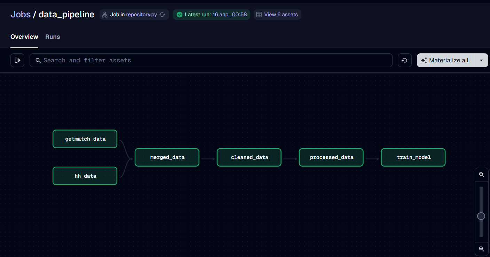
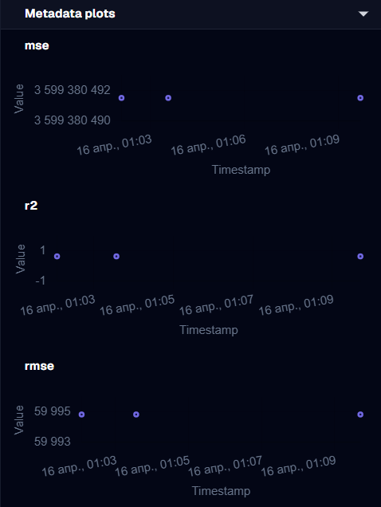

# Результаты выполнения pipeline

Также можно отслеживать изменения метрик при повторных запусках (например, настроить выполнение по расписанию).
Выводятся основные метрики:
- `R^2`
- `MSE`
- `RMSE`

Можно выполнять как и весь pipeline, так и отдельную часть (например, обучение модели).