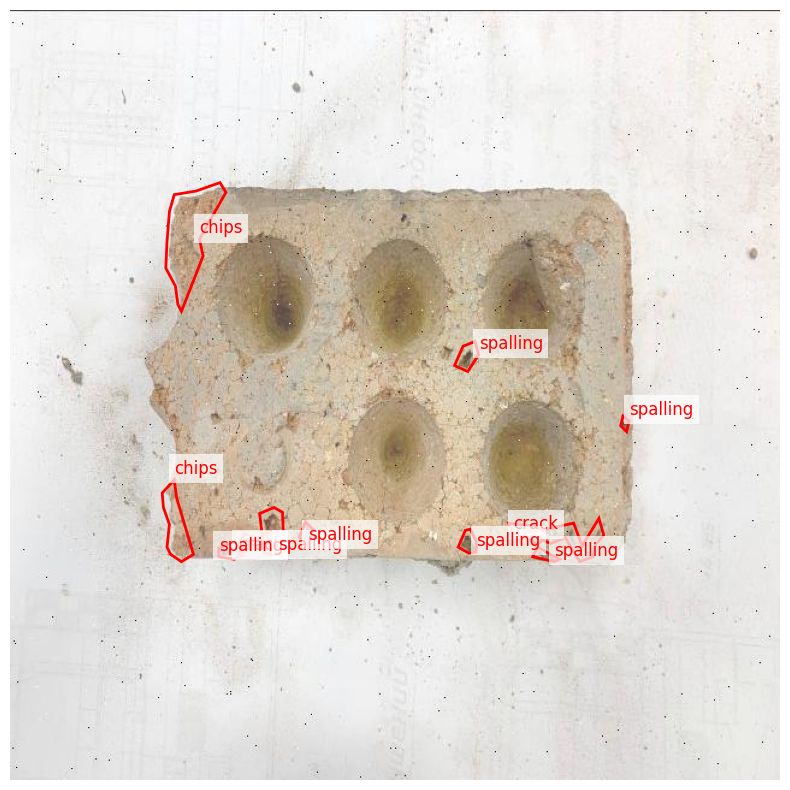

# Задание на разметку изображений кирпичей (сегментация дефектов)

## Общая информация

Вам необходимо провести **сегментацию дефектов** на изображениях кирпичей. Каждый дефект должен быть размечен **полигоном** с указанием соответствующего класса.

Размечаемые классы:

- `chips` — сколы
- `crack` — трещины
- `spalling` — выкрашивания поверхности

## Описание классов

### 1. `chips` (Сколы)
- Повреждение краёв, углов кирпича.
- Часто выглядит как отломанная часть по границе.
- Размечать только область скола, не включая прилегающие целые участки.

### 2. `crack` (Трещины)
- Линейные повреждения поверхности кирпича.
- Разметка производится по всей длине трещины.
- Используйте узкий, но точный полигон вдоль трещины.

### 3. `spalling` (Выкрашивание)
- Поверхностные разрушения: расслоения, обсыпание, ямки.
- Чаще всего встречаются возле отверстий или краёв.
- Размечать область выкрашивания, не включая ровные, неповреждённые участки.

## Инструменты

Для разметки используйте один из следующих инструментов:

- [CVAT](https://cvat.ai)
- [LabelMe](http://labelme.csail.mit.edu/)
- [Roboflow Annotate](https://roboflow.com)

## Пример разметки

На примере:
- Красным контуром обозначены дефекты.
- Подписаны классы: `chips`, `crack`, `spalling`.

## Валидация

В датасет подмешаны **тестовые изображения** с заранее известной разметкой. Они используются:
- Для проверки понимания ТЗ.
- Для оценки метрики согласованности между аннотаторами (IoU/пересечение масок).

## Что нужно вернуть

- Размеченные изображения в исходном формате выбранной платформы:
  - CVAT: `.xml`, `.json`
  - LabelMe: `.json`
  - Roboflow: `.json`, `.txt` и пр.
- Архив или ссылка на скачивание результата

## Последующий анализ

После получения разметки:
- Будут найдены и устранены выбросы, дубликаты, некорректные аннотации.
- Оценена метрика согласованности (если аннотацию делали два человека).
- При необходимости предоставлена обратная связь.

